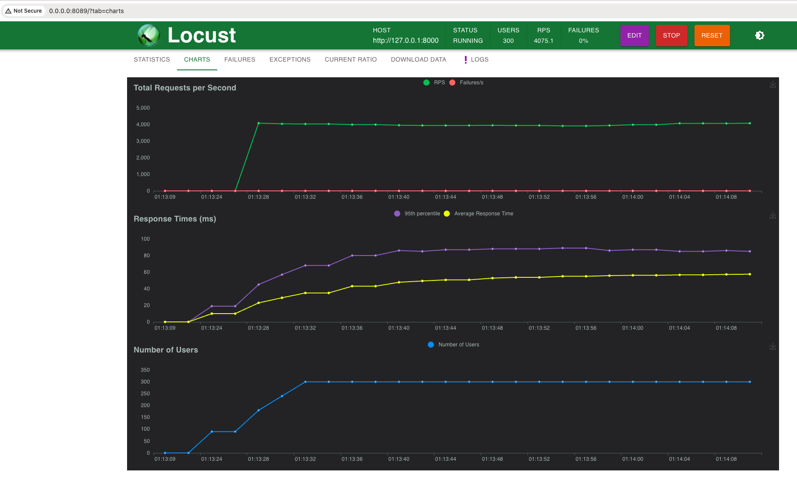

# Deduplication and throttling gateway.
## Implemented with FastAPI, Celery and Redis.

### Setup
- install redis
- do following steps:
```shell
cp .env.example .env

python -m venv .venv

source .venv/bin/activate

pip install -r requirements.txt
```

### Run Celery
```shell
celery -A worker.celery worker --loglevel=info
```

### Run FastAPI
```shell
uvicorn main:app --reload
```


### Locust run results
